# arch-timeshift-vm

Restaura um snapshot do Timeshift/BTRFS do host em uma VM libvirt/KVM
bootável e descartável, inteiramente no host - sem VirtioFS e sem ISO de
instalação.

> Status: fases 1-5 implementadas e validadas (preflight, disco, restore, boot
> e libvirt). Tier 1 e Tier 2 verdes. Veja [`docs/PLAN.md`](docs/PLAN.md) para
> o plano por fases e o andamento.

## Como funciona

O snapshot Timeshift é restaurado para um disco novo (`qcow2`) montado via
NBD no host, transformado em um sistema bootável (BTRFS + ESP + GRUB UEFI) e
entregue ao libvirt. Sem VirtioFS e sem ISO de instalação.

```mermaid
flowchart TB
    classDef gate fill:#fff4e6,stroke:#e8590c,stroke-width:2px,color:#7a2e00
    classDef ro fill:#e7f5ff,stroke:#1971c2,stroke-width:2px,color:#0b3d66
    classDef rw fill:#e6fcf5,stroke:#0ca678,stroke-width:2px,color:#064e3b
    classDef danger fill:#fff0f6,stroke:#c2255c,stroke-width:2px,color:#6b0f3a
    classDef done fill:#f3f0ff,stroke:#7048e8,stroke-width:2px,color:#3b1f8a

    Start(["sudo ansible-playbook<br/>playbooks/restore.yml"]) --> Gate

    subgraph P1["1 · snapshot — preflight somente leitura"]
        direction TB
        Gate{"confirm_restore == true?"}:::gate
        Gate -- "não, padrão seguro" --> Abort(["Aborta: nada é tocado"]):::danger
        Gate -- "sim" --> A["findmnt descobre o topo BTRFS<br/>e timeshift-btrfs/snapshots<br/>(timeshift_root: auto)"]:::ro
        A --> B["resolve o snapshot<br/>@ + @home + info.json"]:::ro
        B --> C["valida subvolumes e @ read-only"]:::ro
        C --> D{"vm_disk dentro de vm_images_dir<br/>e espaço livre suficiente?"}:::gate
        D -- "não" --> Abort
        D -- "sim" --> E["publica fatos:<br/>resolved_snapshot, snapshot_root,<br/>snapshot_home, vm_disk_real"]:::ro
    end

    subgraph P2["2 · disk — alvo descartável (qcow2 + NBD)"]
        direction TB
        F["qemu-img create qcow2 temporário"]:::rw
        G["qemu-nbd connect /dev/nbdN (detectado)"]:::rw
        H["sgdisk: GPT = ESP vfat + raiz BTRFS"]:::rw
        I["mkfs.fat + mkfs.btrfs<br/>monta em diretórios temporários"]:::rw
        F --> G --> H --> I
    end

    subgraph P3["3 · restore — snapshot para o disco da VM"]
        direction TB
        J["btrfs send/receive<br/>@ e @home → disco novo"]:::rw
        K["gera o /etc/fstab da VM<br/>com os UUIDs do alvo"]:::rw
        L["identidade do clone<br/>hostname + machine-id"]:::rw
        J --> K --> L
    end

    subgraph P4["4 · boot — kernel e GRUB UEFI"]
        direction TB
        M["copia vmlinuz/initramfs<br/>de /usr/lib/modules/VER para a ESP"]:::rw
        N["grub-install na ESP + grub.cfg"]:::rw
        M --> N
    end

    subgraph P5["5 · libvirt — sobe a VM"]
        direction TB
        O["gera domain.xml + NVRAM OVMF"]:::rw
        P["virsh define + start"]:::rw
        O --> P
    end

    E --> F
    I --> J
    L --> M
    N --> T["umount + qemu-nbd -d<br/>(libera o alvo antes do libvirt)"]:::rw
    T --> O
    P --> VM(["VM bootável e descartável"]):::done

    Cleanup["teardown (always)<br/>umount · qemu-nbd -d · virsh undefine<br/>troca atômica do vm_disk"]:::danger
    H -.->|em qualquer falha| Cleanup
    I -.->|em qualquer falha| Cleanup
    N -.->|em qualquer falha| Cleanup
    P -.->|em qualquer falha| Cleanup
    Cleanup --> Safe(["host intacto: /etc/fstab<br/>e snapshots nunca tocados"]):::done
```



Legenda: a fase 1 é somente leitura; as fases 2–5 mutam apenas o disco e o
domínio libvirt da VM; o `teardown` roda sempre (`block/rescue/always` nos
roles mutantes).

## Requisitos

No host Arch Linux:

- `ansible-core` (via `.venv`, veja abaixo)
- Ferramentas de sistema: `qemu-img`, `qemu-nbd`, `libvirt`/`virsh`,
  `btrfs-progs`, `dosfstools` (`mkfs.fat`), `gptfdisk` (`sgdisk`),
  `grub`, `arch-install-scripts` (`arch-chroot`), `edk2-ovmf`.

```bash
sudo pacman -S --needed qemu-img qemu-nbd libvirt btrfs-progs \
  dosfstools gptfdisk grub arch-install-scripts edk2-ovmf
```

Não instale o Ansible globalmente. Use o virtualenv do projeto.

## Instalação (desenvolvimento)

```bash
make venv    # cria .venv e instala as dependências pinadas
make deps    # instala as collections do requirements.yml
make lint    # yamllint + ansible-lint
make syntax  # syntax-check dos playbooks
make test    # Molecule Tier 1 (Docker, sem privilégio)
make test-integration   # Molecule Tier 2 (BTRFS sintético; pede sudo)
```

## Uso

Revise `group_vars/all.yml`. O playbook é destrutivo para o disco da VM
nomeada e recusa executar até ser confirmado explicitamente:

```bash
sudo ansible-playbook playbooks/restore.yml -e confirm_restore=true
```

Snapshot específico:

```bash
sudo ansible-playbook playbooks/restore.yml \
  -e confirm_restore=true -e snapshot=2026-09-16_13-00-00
```

Outra VM:

```bash
sudo ansible-playbook playbooks/restore.yml \
  -e confirm_restore=true -e vm_name=archlinux-timeshift-test
```

## Testes

- `make test` - Molecule Tier 1: lógica, templates e contratos de variáveis
  em container Docker.
- `make test-integration` - Molecule Tier 2: detecção BTRFS e validação de
  snapshot em sandbox com BTRFS sintético (loopback); **requer root** (o
  alvo chama `sudo -E`).
- `make e2e` - Tier 3 (na Fase 6): boot real da VM com KVM aninhado.

Nenhum teste toca snapshots reais nem imagens reais. Veja
[`docs/ARCHITECTURE.md`](docs/ARCHITECTURE.md).

## Segurança

- `confirm_restore: false` por padrão.
- `timeshift_root: auto` detecta o subvolume topo do BTRFS e o diretório real
  de snapshots; dispensa caminhos fixos.
- `vm_disk` é canonicalizado e validado contra `vm_images_dir` antes de
  qualquer remoção, com checagem de espaço livre.
- O `/etc/fstab` do host nunca é modificado (mounts efêmeros).
- Cleanup automático em caso de falha.

## Estrutura

```
ansible.cfg
requirements.yml / requirements-dev.txt
Makefile
docs/{PLAN,ARCHITECTURE}.md
group_vars/all.yml
inventory/localhost.yml
playbooks/restore.yml
roles/{snapshot,disk,restore,boot,libvirt}/
molecule/{default,integration}/
scripts/
```

## Licença

MIT (a definir na Fase 6).
