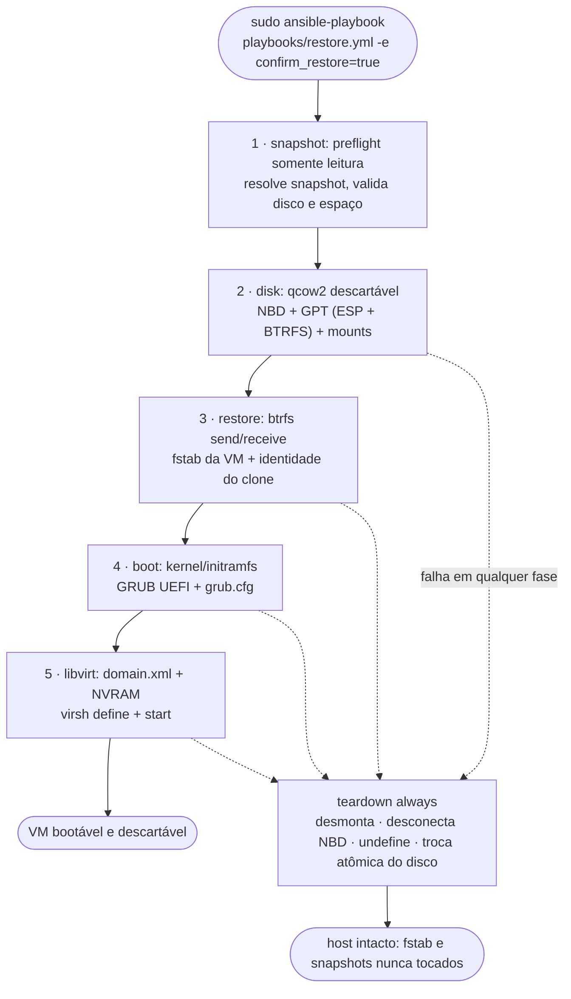
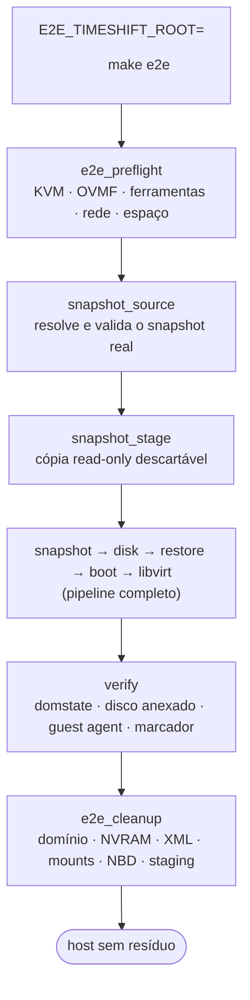

# Uso operacional

## Validação antes da execução

O fluxo destrói e recria somente o disco indicado por `vm_disk`, mas inicia
com `confirm_restore: false`. Revise `group_vars/all.yml`, confirme que
`vm_disk` está dentro de `vm_images_dir` e valide que o snapshot escolhido é
descartável.

## Execução normal

```bash
sudo ansible-playbook playbooks/restore.yml -e confirm_restore=true
```

Fluxo completo de uma execução. O `teardown` roda sempre — em sucesso ou
falha — e garante que o host não fique com mounts, NBD ou resíduo:



Para selecionar um snapshot e uma VM:

```bash
sudo ansible-playbook playbooks/restore.yml \
  -e confirm_restore=true \
  -e snapshot=2026-09-16_13-00-00 \
  -e vm_name=archlinux-timeshift-test
```

## Teste end-to-end

O teste E2E exige um diretório Timeshift montado no topo BTRFS e um snapshot
com kernel, initramfs, GRUB e os serviços necessários para iniciar. Ele nunca
seleciona um snapshot por heurística; o snapshot usado é registrado em
`e2e-vars.yml` no diretório de trabalho. Para usar o snapshot mais recente:

```bash
E2E_TIMESHIFT_ROOT=/mnt/btrfs-top/timeshift-btrfs/snapshots make e2e
```

O fluxo do E2E valida o host e a fonte antes de tocar qualquer disco, usa uma
cópia read-only do snapshot real e limpa tudo ao final:



O que acontece:

1. `e2e_preflight` valida KVM, ferramentas, OVMF, rede libvirt
   (`qemu:///system`) e espaço — sem alterar o host.
2. `snapshot_source` resolve e valida o snapshot (`latest` ou nome exato).
3. `snapshot_stage` cria uma cópia BTRFS read-only descartável em
   `/var/tmp/arch-timeshift-vm-stage` (os snapshots reais nunca são mutados).
4. O pipeline (`snapshot`, `disk`, `restore`, `boot`, `libvirt`) produz a VM
   em `/var/tmp/arch-timeshift-vm-e2e` e a inicia com UEFI/KVM.
5. `verify` aguarda `virsh domstate` chegar a `running`, confere o disco
   restaurado anexado e, enquanto o domínio roda, tenta obter do **QEMU
   guest agent** uma resposta a `guest-ping` pelo canal virtio-serial
   `org.qemu.guest_agent.0` — exigida quando o snapshot oferece o agente
   (binário `qemu-ga` + unit `qemu-guest-agent.service` no clone). Depois
   desliga a VM de forma controlada e usa `destroy` apenas como fallback se
   o guest não responder. Por fim valida em modo somente leitura o marcador
   `/etc/arch-timeshift-vm/e2e-boot-ok` criado pelo serviço systemd do
   guest. `running` sozinho comprova apenas que o processo QEMU foi iniciado.
6. `e2e_cleanup` (sempre) desliga/undefine o domínio, remove NVRAM/XML,
   desmonta, desconecta NBD e remove imagem e staging.

Para validar somente a fonte usando o Ansible do virtualenv:

```bash
SNAPSHOT_SOURCE_ROOT=/mnt/btrfs-top/timeshift-btrfs/snapshots \
  make prepare-e2e
```

Não use `sudo ansible-playbook` diretamente, pois o `ansible-playbook`
instalado no `.venv` pode não estar no `PATH` do usuário root.

### Criar um snapshot novo

Separado da validação, exige duas confirmações e a ferramenta `timeshift`:

```bash
sudo "$(pwd)/.venv/bin/ansible-playbook" playbooks/prepare-e2e.yml \
  -e snapshot_source_create=true \
  -e snapshot_source_create_confirm=true \
  -e snapshot_source_root=/mnt/btrfs-top/timeshift-btrfs/snapshots
```

### Rede libvirt ausente ou parada

Por padrão, uma rede sem `Active: yes` apenas causa falha com instruções.
Para permitir que o playbook defina, habilite e inicie a rede padrão
(`/etc/libvirt/qemu/networks/<name>.xml`):

```bash
sudo "$(pwd)/.venv/bin/ansible-playbook" playbooks/prepare-e2e.yml \
  -e snapshot_source_root=/mnt/btrfs-top/timeshift-btrfs/snapshots \
  -e e2e_preflight_prepare_network=true
```

### Limpeza de execução interrompida

```bash
make clean-e2e
```

O comando desliga/undefine o domínio, remove NVRAM e XML, desmonta tudo,
desconecta NBD e remove imagem e staging em `/var/tmp`.

Variáveis opcionais do E2E:

| Variável | Padrão | Finalidade |
| --- | --- | --- |
| `E2E_SNAPSHOT` | `latest` | Nome exato do snapshot |
| `E2E_VM_NAME` | `arch-timeshift-e2e` | Nome temporário do domínio |
| `E2E_IMAGES_DIR` | `/var/tmp/arch-timeshift-vm-e2e/images` | Diretório da imagem |
| `E2E_WORK_DIR` | `/var/tmp/arch-timeshift-vm-e2e/work` | XML, NVRAM e estado |
| `E2E_STAGE_ROOT` | `/var/tmp/arch-timeshift-vm-stage` | Staging BTRFS descartável |
| `E2E_VM_DISK_SIZE` | `80G` | Capacidade virtual fixa do qcow2; a execução é interrompida se `@` + `@home` não couberem |
| `E2E_EFI_SIZE_MIB` | `256` | Tamanho da partição EFI |
| `E2E_VM_MEMORY_MIB` | `2048` | Memória da VM |
| `E2E_VM_VCPUS` | `2` | CPUs virtuais |
| `E2E_NETWORK` | `default` | Rede libvirt usada pelo domínio |
