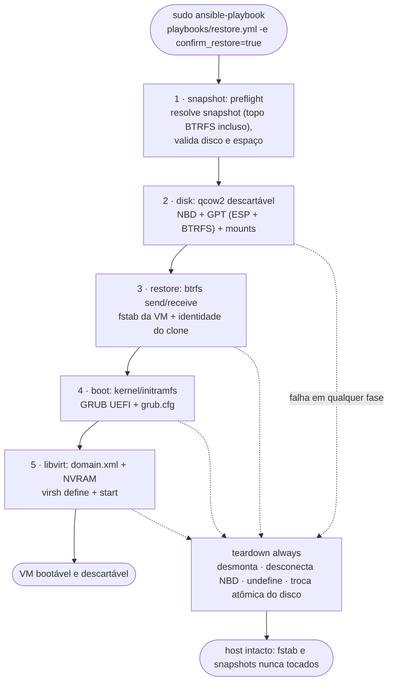
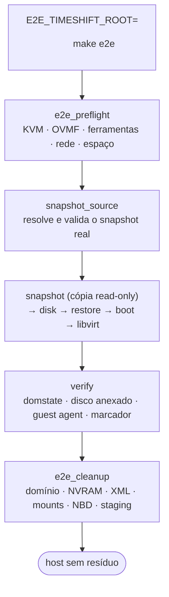

# Uso operacional

## Validação antes da execução

O fluxo destrói e recria somente o disco indicado por `vm_disk`, mas inicia
com `confirm_restore: false`. Revise `group_vars/all.yml` (ou a config em
`/etc/arch-timeshift-vm` / `~/.config/arch-timeshift-vm`), confirme que
`vm_disk` está dentro de `vm_images_dir` e valide que o snapshot escolhido é
descartável.

A única alteração no host antes do disco é o mount efêmero read-only do topo do
BTRFS descrito em [Resolução do topo BTRFS](#resolução-do-topo-btrfs-timeshift_root-auto),
liberado no fim da execução.

## Resolução do topo BTRFS (`timeshift_root: auto`)

O Timeshift grava os snapshots no **subvolume topo do BTRFS** (subvolid=5), como
irmãos de `@` e `@home`:

```
subvolid=5 (topo)
├── @            <- /
├── @home        <- /home
└── timeshift-btrfs/snapshots/<data>   <- snapshots (irmãos de @)
```

Como `subvol=/@` faz `/` ser o subvolume `@` (e não o topo), o diretório de
snapshots **não é alcançável a partir de `/`** e só aparece se o subvolid 5
estiver montado em algum lugar. Com `timeshift_root: auto` o role `snapshot`:

1. procura um mount existente do topo do dispositivo detectado em `/`
   (`findmnt` com `FSROOT=/`);
2. se não houver, **monta o topo read-only** em
   `/run/arch-timeshift-vm/btrfs-top` com `subvolid=5,ro` — `/run` é tmpfs e
   `mount(8)` é chamado direto, então o `/etc/fstab` do host nunca é
   modificado;
3. deriva o diretório de snapshots e o usa como `snapshot_root_dir`;
4. **desmonta** o mount temporário no fim da execução. O `preflight.yml` e o
   `restore.yml` o liberam num bloco `always`, então um guard que aborta o play
   também desmonta — se o run for interrompido no meio, resta o
   `arch-timeshift-vm cleanup` / `make clean-e2e`.

O `restore` precisa do mount enquanto o role `restore` executa `btrfs send`, e
por isso a desmontagem pertence ao play (`include_role` dentro de `block` +
`always`), não ao role `snapshot`.

Read-only basta: o pipeline apenas lê os snapshots da fonte — as cópias de
staging ficam em `work_dir`/`/var/tmp` e `btrfs send` aceita mount `ro`.

O relatório do `preflight` mostra qual topo foi usado:

```
Top-level     : /run/arch-timeshift-vm/btrfs-top (temporary, released at the end of this run)
```

### Desligar o fallback

| Variável | Padrão | Finalidade |
| --- | --- | --- |
| `timeshift_root` | `auto` | `auto` resolve o topo; um caminho explícito (`/mnt/btrfs-top/timeshift-btrfs/snapshots`) pula a detecção |
| `timeshift_autodetect_mount_top` | `true` | `false` mantém a detecção estritamente read-only e exige um topo já montado |
| `snapshot_top_mount_point` | `/run/arch-timeshift-vm/btrfs-top` | Onde o mount temporário é feito |
| `snapshot_top_mount_opts` | `subvolid=5,ro` | Opções do mount temporário |
| `timeshift_device` | `""` | Sobrescreve o dispositivo detectado a partir de `/` |
| `snapshot_refuse_live_boot_state` | `false` | `true` aborta quando o host está rodando a partir do snapshot avaliado |
| `snapshot_stage_root` | `/var/tmp/arch-timeshift-vm-stage` | Onde a cópia read-only do snapshot é criada. Precisa estar no mesmo filesystem BTRFS dos snapshots |
| `snapshot_stage_min_free_bytes` | `1G` | Margem mínima de espaço livre exigida no filesystem de staging |

### A cópia descartável do snapshot

O `btrfs send` exige que os subvolumes do stream carreguem o flag `ro`, e o
Timeshift cria snapshots read-write. O pipeline **nunca** ajusta o snapshot real
nem envia a partir dele: ele tira uma cópia read-only por copy-on-write
(`btrfs subvolume snapshot -r`) e envia a cópia. Como a cópia compartilha todos os
extents com a origem, ela custa quase nada de espaço.

Duas exigências vêm daí:

1. a cópia precisa ficar no **mesmo filesystem BTRFS** dos snapshots
   (`btrfs subvolume snapshot` não cruza filesystems). O padrão
   `/var/tmp/arch-timeshift-vm-stage` está no BTRFS raiz no layout comum
   (`subvol=/@`);
2. o filesystem de staging precisa manter espaço livre
   (`snapshot_stage_min_free_bytes`, padrão `1G`) — margem para metadados, não o
   tamanho do snapshot.

Se o padrão não servir, aponte `snapshot_stage_root` para um diretório gravável
no mesmo BTRFS. Um caminho em outro filesystem (um `/data` ext4, por exemplo) é
recusado com uma mensagem explícita:

```bash
arch-timeshift-vm preflight -e confirm_restore=true \
  -e snapshot_stage_root=/mnt/btrfs-top/.stage
# snapshot_stage_root '...' is on ext4 device ..., but the snapshots are on
# btrfs device ... A non-BTRFS disk cannot hold it.
```

O snapshot real permanece listável, restaurável e apagável pelo Timeshift
exatamente como era: a cópia vive em `snapshot_stage_root` e é removida ao fim da
execução (inclusive quando um guard aborta o run).

Com `timeshift_autodetect_mount_top=false` e nenhum topo montado, o preflight
falha com a linha de `fstab` pronta para colar. Montar o topo permanentemente é
a opção mais previsível — o auto-mount existe para não bloquear o primeiro uso,
não para substituir a configuração do host:

```bash
# /etc/fstab (UUID= conforme blkid -s UUID -o value /dev/nvme0n1p2)
UUID=<uuid>  /mnt/btrfs-top  btrfs  subvolid=5,ro,x-systemd.automount,nofail  0 0
```

Com o topo montado, `arch-timeshift-vm preflight -e confirm_restore=true`
resolve `<topo>/timeshift-btrfs/snapshots` sem montar nada.

### Auditoria de boot state

Um snapshot do Timeshift é um `@`/`@home` read-only gravados durante um boot. Se
o host **estiver rodando a partir do próprio snapshot** avaliado (recovery por
snapshot), o `@` avaliado não é um estado passado: restaurá-lo devolveria o
estado atual. O `preflight` compara o boot state do host com o snapshot e reporta:

| Verificação | Fonte |
| --- | --- |
| `@` do snapshot é o subvolume que o host bootou | `btrfs subvolume show` vs `/sys/fs/btrfs/rootid` |
| `@` do snapshot é o subvolume default do filesystem | `btrfs subvolume get-default` vs subvolume ID |
| `@home` do snapshot é o subvolume default do filesystem | idem para `@home` |
| linha de comando do kernel aponta para o snapshot | `/proc/cmdline` (`subvol=` ou `rootflags=subvol=`) |
| `FSROOT` do host está dentro de `timeshift-btrfs/snapshots/` | `findmnt` |

As comparações por subvolume ID só valem dentro do mesmo filesystem: quando o
snapshot está em outro dispositivo o relatório diz `not audited`, porque IDs de
subvolumes de BTRFS distintos colidem por acaso.

Por padrão os achados são **warning** — booting por snapshot é um modo de
recovery legítimo e o pipeline nunca exclui snapshots da lista. Para recusar:

```bash
arch-timeshift-vm preflight -e confirm_restore=true \
  -e snapshot_refuse_live_boot_state=true
```

### Tamanho do snapshot

O `preflight` também mede o espaço do snapshot com
`btrfs filesystem du --summarize`, reportando `total` (compartilhado com o
pai), `exclusive` (dados únicos do snapshot) e `shared` por subvolume. O número
que interessa para o disco da VM é o `exclusive`.

## CLI standalone

O wrapper `arch-timeshift-vm` resolve o venv, as collections e o PATH
internamente — não sofre o problema de PATH do `sudo ansible-playbook`
documentado abaixo — e aplica `flock` contra execuções concorrentes:

```bash
./scripts/arch-timeshift-vm install          # venv + collections + sudoers + wrapper
arch-timeshift-vm init                       # cria ~/.config/arch-timeshift-vm/config.yml
arch-timeshift-vm preflight -e confirm_restore=true
arch-timeshift-vm plan -e confirm_restore=true
arch-timeshift-vm restore -e confirm_restore=true
arch-timeshift-vm cleanup -e confirm_restore=true
```

A config segue a precedência `/etc/arch-timeshift-vm/config.yml` →
`~/.config/arch-timeshift-vm/config.yml` → `group_vars/all.yml`; flags `-e`
sempre vencem. `restore`/`plan`/`preflight`/`cleanup` exigem o
`-e confirm_restore=true` explícito como porta de segurança.

## Execução normal

```bash
sudo ansible-playbook playbooks/restore.yml -e confirm_restore=true
```

Fluxo completo de uma execução. O `teardown` roda sempre — em sucesso ou
falha — e garante que o host não fique com mounts, NBD ou resíduo:


```mermaid
flowchart TD
    Start(["sudo ansible-playbook<br/>playbooks/restore.yml -e confirm_restore=true"]) --> Pre
    Pre["1 · snapshot: preflight<br/>resolve snapshot (topo BTRFS incluso),<br/>valida disco e espaço"] --> Disk
    Disk["2 · disk: qcow2 descartável<br/>NBD + GPT (ESP + BTRFS) + mounts"] --> Rst
    Rst["3 · restore: btrfs send/receive<br/>fstab da VM + identidade do clone"] --> Boot
    Boot["4 · boot: kernel/initramfs<br/>GRUB UEFI + grub.cfg"] --> Lib
    Lib["5 · libvirt: domain.xml + NVRAM<br/>virsh define + start"] --> VM(["VM bootável e descartável"])
    Disk -. "falha em qualquer fase" .-> Cleanup
    Rst -.-> Cleanup
    Boot -.-> Cleanup
    Lib -.-> Cleanup
    Cleanup["teardown always<br/>desmonta · desconecta NBD · undefine · troca atômica do disco"] --> Safe(["host intacto: fstab e snapshots nunca tocados"])
```

Para selecionar um snapshot e uma VM:

```bash
sudo ansible-playbook playbooks/restore.yml \
  -e confirm_restore=true \
  -e snapshot=2026-09-16_13-00-00 \
  -e vm_name=archlinux-timeshift-test
```

## Teste end-to-end

O teste E2E exige um diretório Timeshift montado no topo BTRFS e um snapshot
com kernel, initramfs, GRUB e os serviços necessários para iniciar. Ele nunca
seleciona um snapshot por heurística; o snapshot usado é registrado em
`e2e-vars.yml` no diretório de trabalho. Para usar o snapshot mais recente:

```bash
E2E_TIMESHIFT_ROOT=/mnt/btrfs-top/timeshift-btrfs/snapshots make e2e
```

O fluxo do E2E valida o host e a fonte antes de tocar qualquer disco, usa uma
cópia read-only do snapshot real e limpa tudo ao final:


```mermaid
flowchart TD
    E["E2E_TIMESHIFT_ROOT=<dir> make e2e"] --> PF["e2e_preflight<br/>KVM · OVMF · ferramentas · rede · espaço"]
    PF --> SS["snapshot_source<br/>resolve e valida o snapshot real"]
    SS --> PIPE["snapshot (cópia read-only)<br/>→ disk → restore → boot → libvirt"]
    PIPE --> VF["verify<br/>domstate · disco anexado · guest agent · marcador"]
    VF --> CL["e2e_cleanup<br/>domínio · NVRAM · XML · mounts · NBD · staging"]
    CL --> Z(["host sem resíduo"])
```

O que acontece:

1. `e2e_preflight` valida KVM, ferramentas, OVMF, rede libvirt
   (`qemu:///system`) e espaço — sem alterar o host.
2. `snapshot_source` resolve e valida o snapshot (`latest` ou nome exato).
3. O role `snapshot` tira uma cópia BTRFS read-only descartável
   (`btrfs subvolume snapshot -r`) em `snapshot_stage_root`
   (`/var/tmp/arch-timeshift-vm-stage` por padrão) e envia a cópia — os snapshots
   reais nunca são mutados.
4. O pipeline (`snapshot`, `disk`, `restore`, `boot`, `libvirt`) produz a VM
   em `/var/tmp/arch-timeshift-vm-e2e` e a inicia com UEFI/KVM.
5. `verify` aguarda `virsh domstate` chegar a `running`, confere o disco
   restaurado anexado e, enquanto o domínio roda, tenta obter do **QEMU
   guest agent** uma resposta a `guest-ping` pelo canal virtio-serial
   `org.qemu.guest_agent.0` — exigida quando o snapshot oferece o agente
   (binário `qemu-ga` + unit `qemu-guest-agent.service` no clone). Depois
   desliga a VM de forma controlada e usa `destroy` apenas como fallback se
   o guest não responder. Por fim valida em modo somente leitura o marcador
   `/etc/arch-timeshift-vm/e2e-boot-ok` criado pelo serviço systemd do
   guest. `running` sozinho comprova apenas que o processo QEMU foi iniciado.
6. `e2e_cleanup` (sempre) desliga/undefine o domínio, remove NVRAM/XML,
   desmonta, desconecta NBD e remove imagem e staging.

Para validar somente a fonte usando o Ansible do virtualenv:

```bash
SNAPSHOT_SOURCE_ROOT=/mnt/btrfs-top/timeshift-btrfs/snapshots \
  make prepare-e2e
```

Não use `sudo ansible-playbook` diretamente, pois o `ansible-playbook`
instalado no `.venv` pode não estar no `PATH` do usuário root.

### Criar um snapshot novo

Separado da validação, exige duas confirmações e a ferramenta `timeshift`:

```bash
sudo "$(pwd)/.venv/bin/ansible-playbook" playbooks/prepare-e2e.yml \
  -e snapshot_source_create=true \
  -e snapshot_source_create_confirm=true \
  -e snapshot_source_root=/mnt/btrfs-top/timeshift-btrfs/snapshots
```

### Rede libvirt ausente ou parada

Por padrão, uma rede sem `Active: yes` apenas causa falha com instruções.
Para permitir que o playbook defina, habilite e inicie a rede padrão
(`/etc/libvirt/qemu/networks/<name>.xml`):

```bash
sudo "$(pwd)/.venv/bin/ansible-playbook" playbooks/prepare-e2e.yml \
  -e snapshot_source_root=/mnt/btrfs-top/timeshift-btrfs/snapshots \
  -e e2e_preflight_prepare_network=true
```

### Limpeza de execução interrompida

```bash
make clean-e2e
```

O comando desliga/undefine o domínio, remove NVRAM e XML, desmonta tudo,
desconecta NBD e remove imagem e staging em `/var/tmp`.

Variáveis opcionais do E2E:

| Variável | Padrão | Finalidade |
| --- | --- | --- |
| `E2E_SNAPSHOT` | `latest` | Nome exato do snapshot |
| `E2E_VM_NAME` | `arch-timeshift-e2e` | Nome temporário do domínio |
| `E2E_IMAGES_DIR` | `/var/tmp/arch-timeshift-vm-e2e/images` | Diretório da imagem |
| `E2E_WORK_DIR` | `/var/tmp/arch-timeshift-vm-e2e/work` | XML, NVRAM e estado |
| `E2E_STAGE_ROOT` | `/var/tmp/arch-timeshift-vm-stage` | Staging BTRFS descartável |
| `E2E_VM_DISK_SIZE` | `80G` | Capacidade virtual fixa do qcow2; a execução é interrompida se `@` + `@home` não couberem |
| `E2E_EFI_SIZE_MIB` | `256` | Tamanho da partição EFI |
| `E2E_VM_MEMORY_MIB` | `2048` | Memória da VM |
| `E2E_VM_VCPUS` | `2` | CPUs virtuais |
| `E2E_NETWORK` | `default` | Rede libvirt usada pelo domínio |
